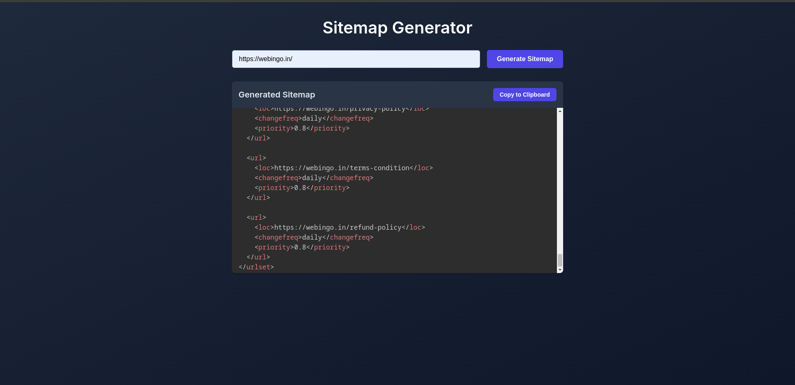

# Sitemap Generator

A web-based application for generating sitemaps for any website. The tool fetches and streams the generated sitemap content, allowing users to easily copy it to the clipboard.

---

## Features

- **Responsive Design**: Built with a modern UI using HTML, CSS, and JavaScript.
- **Live Streaming Output**: Sitemaps are streamed to the output container in real-time.
- **Clipboard Support**: Copy the generated sitemap directly to your clipboard.
- **Customizable Styles**: Easily modify theme colors and styles using CSS variables.
- **Auto Scroll**: Automatically scrolls to the latest content during sitemap generation.

---

## Demo

![Sitemap Generator Demo]

---

## Installation

1. Clone the repository:
   ```bash
   git clone https://github.com/SpectraX07/sitemap-generator.git
   ```

2. Navigate to the project directory:
   ```bash
   cd sitemap-generator
   ```

3. Install dependencies:
   ```bash
   npm install
   ```

4. Start the application:
   ```bash
   npm start
   ```

5. Open the application in your browser:
   ```
   http://localhost:3000
   ```

---

## API Endpoint

Ensure you have an API endpoint that the tool can call to generate the sitemap. The API should:
- Accept a `url` query parameter (e.g., `/api/generate-sitemap?url=https://example.com`).
- Stream the sitemap content in chunks.

---

## Usage

1. Enter the website URL in the input box.
2. Click on the **Generate Sitemap** button.
3. View the generated sitemap in the output container.
4. Use the **Copy to Clipboard** button to copy the sitemap.

---

## Technologies Used

- **HTML5**: Markup structure.
- **CSS3**: Custom theming and responsive design.
- **JavaScript**: Dynamic UI interactions and API integration.
- **Node.js**: Backend server to handle sitemap generation.
- **Prism.js**: Syntax highlighting for the generated sitemap.
- **Google Fonts**: Modern typography using the Inter font family.

---

## Customization

You can customize the color theme by modifying the `:root` variables in the CSS:

```css
:root {
    --primary: #4f46e5;
    --primary-hover: #4338ca;
    --background: #0f172a;
    --foreground: #e2e8f0;
    --card: #1e293b;
    --card-foreground: #e2e8f0;
    --border: #334155;
    --input: #1e293b;
}
```

---

## Known Issues

- Ensure the server hosting the application supports CORS for API requests.
- Proper error handling for invalid or unreachable URLs.

---

## Contributing

1. Fork the repository.
2. Create a new branch:
   ```bash
   git checkout -b feature-branch
   ```
3. Commit your changes:
   ```bash
   git commit -m "Add your message here"
   ```
4. Push to the branch:
   ```bash
   git push origin feature-branch
   ```
5. Open a pull request.

---

## License

This project is licensed under the MIT License. See the [LICENSE](LICENSE) file for details.

---

## Acknowledgments

- [Prism.js](https://prismjs.com/) for syntax highlighting.
- [Google Fonts](https://fonts.google.com/) for typography.
- Inspired by modern web development practices.

---

## Contact

If you have any questions or suggestions, feel free to reach out:

- **Email**: spectraxcodes07@gmail.com
- **GitHub**: [SpectraX07](https://github.com/SpectraX07)

